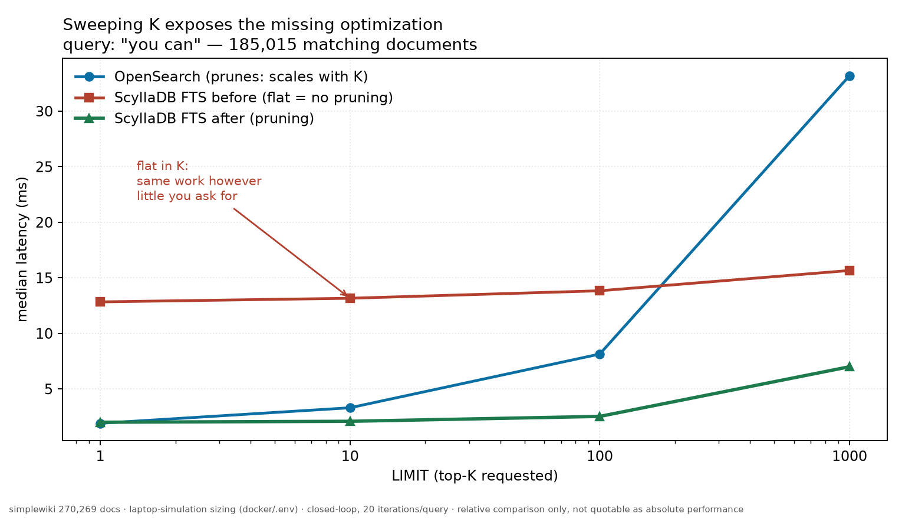
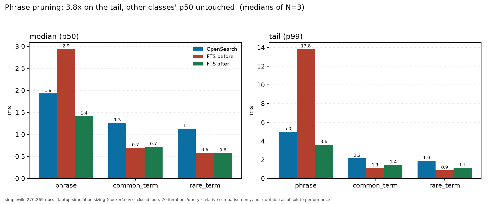

# Slides — "Flat latency is a warning sign: finding a missing optimization by changing LIMIT"

An optimization story for P99 CONF, based on [`README.md`](README.md).
Ten slides plus backup slides.

All numbers come from the laptop test described in the README. They compare
**two builds measured in the same conditions**. They are not absolute
performance numbers, so please do not quote them as such.

The indented blocks are speaker notes. Target time: 8-10 minutes as part of a
talk, or about 15 minutes alone.

---

## S1 — The strange result

**We were faster than OpenSearch in every query type, except one.**

| query class | ScyllaDB FTS | OpenSearch | |
|---|---|---|---|
| single rare term, p50 | **0.58 ms** | 1.13 ms | 1.9x faster |
| single common term, p50 | **0.70 ms** | 1.26 ms | 1.8x faster |
| exact phrase, p50 | 2.94 ms | **1.93 ms** | 1.5x slower |
| **exact phrase, p99** | **13.83 ms** | **4.99 ms** | **2.8x slower** |

> This is a strange result, and strange results are useful.
>
> If we were slower everywhere, the problem would probably be our
> architecture. But we are faster everywhere except one query type, and the
> problem is worst in the tail. This means something specific is wrong. That
> is good news: a specific problem is a problem you can find.
>
> Look at the last row. The p50 is 2.94 ms and the p99 is 13.83 ms. That is
> almost 5 times more. Random noise does not do this. A small group of slow
> queries does this.
>
> (These are medians of three runs. Note: the first time we measured
> OpenSearch, we got 7.2 ms in this row. We had just loaded the index, and the
> JVM was not warm yet. If you measure your competitor unfairly, their
> engineers will find the mistake. More about this on slide 9.)

---

## S2 — First, find what is *not* the problem

Three test paths. Same corpus, same queries, same machine:

| path | what it includes | phrase p99 |
|---|---|---|
| ScyllaDB via CQL | coordinator + network + index + SSTable read | 14.58 ms |
| vector-store direct | only the Tantivy index | 14.42 ms |

> Before you optimize something, find out what you do *not* need to optimize.
>
> Our FTS uses two services: the database, and a vector-store that holds the
> index. So the first suspect is the connection between them.
>
> But it is not the problem. Going directly to the index takes the same time
> as going through the full database path. The coordinator, the network call
> and the SSTable read add almost nothing here. All the time is inside the
> search library.
>
> This small table removed half of the places we needed to look.

---

## S3 — Which queries are slow?

Not all of them. There are two clear groups:

| query | matching docs | ScyllaDB FTS | OpenSearch |
|---|---|---|---|
| `"can help"` | 184,352 | 12.88 ms | 2.66 ms |
| `"you can"` | 185,015 | 12.06 ms | 3.40 ms |
| `"short article"` | 183,915 | 10.60 ms | 2.03 ms |
| ... | | | |
| `"new york"` | 23,746 | 2.61 ms | 1.84 ms |
| `"census bureau"` | 10,542 | **1.49 ms** | 1.78 ms |

Our time ≈ **0.065 µs × number of matches**. Their time stays almost the same.

> Every slow query is part of the same sentence: "This *short article* *can*
> be *made longer*. *You can* *help Wikipedia* by adding to it." This sentence
> is in 68% of simplewiki.
>
> In the other group, where only 10,000-30,000 documents match, we were
> already faster than OpenSearch.
>
> So our cost grows with the number of matching documents. Their cost does
> not. This is the key fact, and it points to one specific thing.

---

## S4 — The measurement that gave us the answer: change LIMIT

Same query. Same index. We changed only `LIMIT`.

| `LIMIT` | OpenSearch | ScyllaDB FTS |
|---|---|---|
| 1 | 1.92 ms | 11.95 ms |
| 10 | 3.64 ms | 12.44 ms |
| 100 | 7.49 ms | 12.49 ms |
| 1000 | 31.10 ms | **15.20 ms** |

**Their time grows 16x. Our time is flat. And at K=1000, we are 2x faster.**



> If I could keep only one slide, it would be this one.
>
> At first, latency that *grows* with K looks like the bad result. It is not.
> It is the sign of an engine that uses pruning. When you ask for 10 results,
> the engine uses this information to skip most of the work. When you ask for
> 1000, it cannot skip, so it does all the work.
>
> Flat latency means the opposite. It means the engine does the same work,
> and it does not matter how many results you asked for. Flat means: no
> pruning.
>
> Now look at the K=1000 row. Here neither engine can use pruning, and we are
> 2 times faster. So our matching and scoring code was never the problem. We
> were only missing a shortcut.

---

## S5 — Check the source code. Do not guess.

Tantivy has a pruning function called `Weight::for_each_pruning`. It exists in
three files:

```
src/query/weight.rs                        <- default version, no pruning
src/query/term_query/term_weight.rs        <- real pruning (block-max WAND)
src/query/boolean_query/boolean_weight.rs  <- real pruning (block-max WAND)
```

`phrase_query/phrase_weight.rs` is not in this list. So it uses the default
version:

```rust
while doc != TERMINATED {
    let score = scorer.score();        // score EVERY match
    if score > threshold {
        threshold = callback(doc, score);
    }
    doc = scorer.advance();            // walk the ENTIRE intersection
}
```

> The `threshold` here only decides if the callback runs. It never skips the
> scoring, and it never skips `advance()`. For a phrase query, `advance()` is
> the function that reads the position lists, and that is the expensive part.
>
> So the cost is `O(total matches)`, and K does not change it. This is exactly
> the behaviour we measured.
>
> This also explains the good half of slide 1. Single-term queries use
> `term_weight.rs`, which has real pruning. We were already winning the
> queries that could use pruning. We were only losing the queries that could
> not.

---

## S6 — The fix: two safe limits

**1. Stop when no document can win any more.**
If `threshold >= bm25_weight.max_score()`, no other document can enter the
results.

**2. Calculate a maximum score for each document, without reading positions.**

```
a phrase needs one occurrence of every word in it
        =>  phrase_freq <= min(term_freq_i)
BM25 always grows when frequency grows
        =>  bm25(fieldnorm, min term_freq) >= real phrase score
```

Term frequencies are already available from the document-level intersection.
**We never read the positions of a document that cannot enter the top-K.**

> Both numbers are upper limits, so both are safe. We only skip documents that
> definitely cannot enter the results.
>
> This is important: it is not an approximation, and there is no setting where
> you lose results to gain speed. You get the same answer, with less work.
>
> The change is about 40 lines in the search library. All 1,038 tests of that
> library still pass.

---

## S7 — Result

| class | before | **after** | OpenSearch |
|---|---|---|---|
| **phrase p99** | 13.83 ms | **3.61 ms** | 4.99 ms |
| phrase p50 | 2.94 ms | **1.41 ms** | 1.93 ms |
| common_term p50 | 0.70 ms | 0.72 ms | 1.26 ms |
| rare_term p50 | 0.58 ms | 0.58 ms | 1.13 ms |

**3.8x faster on phrase p99.** Before, we were 2.8x slower than OpenSearch.
Now we are **1.4x faster**.

These are medians of three runs. The ranges do not overlap: 13.66-16.51 ms
before, 3.54-3.92 ms after.



The K test again, after the fix:

| `LIMIT` | OpenSearch | before | **after** |
|---|---|---|---|
| 1 | 1.77 ms | 12.84 ms | **2.01 ms** |
| 100 | 7.92 ms | 13.84 ms | **2.53 ms** |
| 1000 | 32.88 ms | 15.66 ms | **7.00 ms** |

> The shape of the curve changed, and this is more important than the headline
> number. Before, it was flat, which means no pruning. Now it grows with K,
> which is how an engine with pruning behaves.
>
> Our curve also grows more slowly than the OpenSearch curve. So the advantage
> becomes bigger with larger K: at K=1000 we are 4.7x faster.
>
> The p50 of the other two classes did not change. This is our control: the
> patch only touches the phrase code, and the numbers show this.
>
> Their *p99* is about 0.3 ms higher after the change. These are queries under
> 1.5 ms, and the segment count was different in each rebuild. We report this
> number, we cannot connect it to a patch that adds no code to that path, and
> we will not call it noise only because that is convenient for us.

---

## S8 — "But did you change the results?"

We compared the top-10 documents for all 1,199 queries, before and after:
**67 of 200 phrase queries returned different results.**

This looks like a bug. So we measured what happens when we change *nothing*.
We restarted the **same** binary, rebuilt the in-memory index, and compared
again:

| class | restart, same binary | the patch |
|---|---|---|
| **phrase** | **65 changed** | **67 changed** |
| common_term | 15 | 10 |
| rare_term | 17 | 14 |
| bool_* | 4-14 | 5-8 |

Recall against OpenSearch, jaccard@10: phrase **0.92 → 0.91**. No change.

> This slide almost stopped the project, and it is the lesson I most want to
> share.
>
> Normally, a 33% change in results means you broke something. But an A/B test
> is only as good as its control. And the correct control here is not "the old
> code". It is "the old code, run a second time".
>
> When we restart the same binary, 65 phrase queries change. The reason is
> that about 184,000 almost identical documents compete for 10 places. Their
> BM25 scores are equal, so the order depends on the segment layout, and the
> segment layout is different after every rebuild.
>
> Compared to 65, our 67 is normal noise. Without this measurement, we would
> have done one of two bad things: shipped the change without knowing if it
> was safe, or removed a correct optimization because we were afraid.

---

## S8b — The second optimization, and why we removed it

We used the same method on single-term queries. First we divided a 0.79 ms
query (204,905 matching documents) into parts:

| part | cost | share |
|---|---|---|
| HTTP transport | 0.441 ms | 56% |
| parse + per-segment setup | 0.050 ms | 6% |
| **matching 204,905 docs** | **0.121 ms** | 15% |
| reading 9 more documents | 0.178 ms | 23% |

Reading the documents looked like a good target. For every result, we
decompressed a block of stored fields, only to read one `u64` number. That
was about 20 µs per document. So we moved `primary_id` into a columnar fast
field.

| `LIMIT` | before | after |
|---|---|---|
| 1 | 0.57 ms | 0.63 ms |
| 100 | 1.40 ms | 1.47 ms |
| 1000 | **3.23 ms** | **3.23 ms** |

**No difference. We removed the change.**

> Where did the 20 µs come from? From the step between `LIMIT 1` and
> `LIMIT 10`. That step includes one-time costs that happen only for the first
> documents.
>
> When we measured in the right place — between 100 and 1000 — the real cost
> per extra document was only about 2 µs. The Tantivy document store is cheap
> here because our documents are very small: one `u64` each. So one
> decompressed block serves many results. There were never 20 µs per document
> to save.
>
> We shipped nothing, and the index would have become about 6% bigger. But the
> day was not wasted. The alternative was to ship the change and believe a
> number that we had not checked.
>
> Also look at the matching row: 0.12 ms for 205,000 documents. Single-term
> queries already use the pruning that phrase queries did not have. That query
> class was never the problem.

---

## S9 — What we learned

1. **Remove suspects before you optimize.** Two test paths around the
   suspicious component took one afternoon and removed half of the places we
   had to look.
2. **Flat latency is a warning sign.** If latency ignores a parameter that
   should change it, an optimization is probably missing. Change that
   parameter and look at the shape.
3. **A good p50 can hide a bad tail.** Our median looked almost equal. The
   p99 showed that one query class was broken.
4. **Measure your control twice.** "What changes when I change nothing?" is
   cheap, and it protects you from false alarms and from false confidence.
5. **Warm up the engine you compare against.** Our first OpenSearch number was
   44% too slow, because three warm-up queries do not warm up a JVM. It would
   have made our result look better than it is.
6. **Divide the cost into parts, and measure each part in the right place.**
   We built and removed a second optimization, because the 20 µs per document
   was only a one-time cost at the beginning.
7. **If you lose in one place, that is a bug to fix, not a final result.** At
   K=1000 we were 2x faster the whole time.

---

## Backup slides

### B1 — The same corpus property explains the recall complaint

Phrase agreement with OpenSearch was 0.43 on a 5,000-document sample, 0.52 on
a 500,000-document enwiki sample, and **0.91 on the full 270,269-document
simplewiki corpus**.

The phrase queries are generated from Wikipedia redirect and stub template
text. This text creates two things: very large groups of documents with equal
scores (which changes recall), and a very large number of matches (which
changes latency). One property of the corpus, two symptoms, and no engine
defect.

### B2 — How we built both versions, and four problems we found

Both versions were built from the same commit, with the same toolchain and the
same flags. Only the `[patch.crates-io]` line is different. The control build
gives the same numbers as the official image, so our local build adds no bias.

- When we removed the patch line, Cargo changed `"0.26.1"` **to 0.26.2**. Our
  first control used a different library version than our test version. Use
  `--precise` to pin it.
- We built the image `FROM ubi9-minimal` on a Fedora 44 host. The binary did
  not start: `GLIBC_2.38 not found`.
- The first OpenSearch measurement used an index that we had just loaded. It
  was **44% slower** than the same index measured warm (phrase p99 7.21 ms
  against 4.99 ms, with the same 4 segments). Three warm-up queries per query
  are not enough for a JVM. We measured again warm, and all comparisons use
  the warm numbers.
- Our A/B script waited for the index *status* endpoint. After a restart, this
  endpoint still reports the **old** index as `SERVING` with the full document
  count, while the new container is still building. So the script continued
  immediately, and the benchmark failed with `503` errors. Wait for the
  endpoint that your measurement really calls.

### B3 — How to reproduce this

```bash
./optimization/phrase/run_ab.sh 3            # N=3 A/B, both images
python3 optimization/phrase/probe_phrase.py  # match counts + K sweep
python3 optimization/phrase/dump_results.py --diff before.json after.json
```

### B4 — Important limitation

These tests use laptop settings (`docker/.env`): 2 GiB for ScyllaDB, and a
load generator that shares 22 mixed CPU cores with the engines. They are valid
for comparing two builds in identical conditions, and that is the only claim
we make here. Please do not quote them as absolute performance numbers.

All OpenSearch queries used `_source: false` and `track_total_hits: false`, so
both engines returned only identity and score. This measures the index lookup.
A test that also returns document text is a different measurement.
